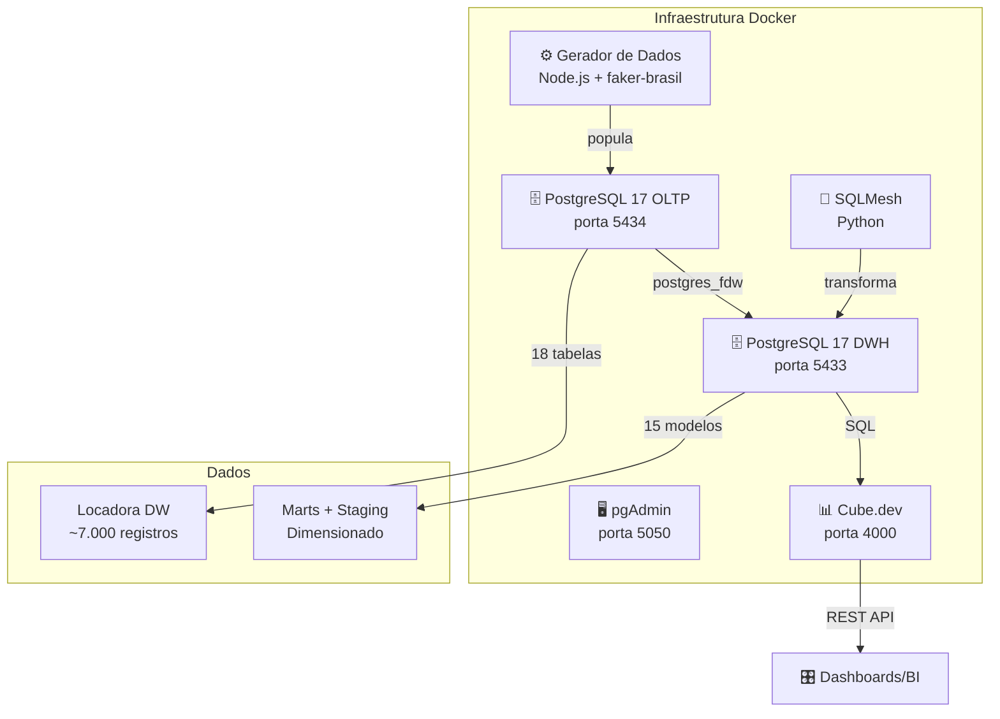

# 🚗 Locadora DW — Data Warehouse para Grupo de Locadoras

Projeto acadêmico de modelagem de Data Warehouse para um grupo de 6 empresas de locação de veículos que compartilham pátios no Rio de Janeiro.

**Disciplina:** Modelagem de Data Warehouse  
**Entrega:** Parte I (Modelagem SBD OLTP)

---

## 📋 Status dos Entregáveis — Parte I

| # | Entregável | Status | Local |
|---|-----------|--------|-------|
| 1 | **Documento descritivo do projeto** | ✅ | [`docs/PARTE_I.md`](docs/PARTE_I.md) |
| 2 | **Dicionário de Dados** | ✅ | [`docs/PARTE_I.md#6-dicionário-de-dados`](docs/PARTE_I.md#6-dicionário-de-dados) |
| 3 | **Modelo Conceitual (MER)** | ✅ | [`docs/PARTE_I.md#2-modelo-conceitual-mer`](docs/PARTE_I.md#2-modelo-conceitual-mer) |
| 4 | **Modelo Lógico** | ✅ | [`docs/PARTE_I.md#3-modelo-lógico-relacional`](docs/PARTE_I.md#3-modelo-lógico-relacional) |
| 5 | **Modelo Físico (SQL/DDL)** | ✅ | [`migrations/001_create_schema.sql`](migrations/001_create_schema.sql) |
| 6 | **Enunciado completo** | ✅ | [`docs/ENUNCIADO.md`](docs/ENUNCIADO.md) |

**Extras (não obrigatórios na Parte I, mas preparatórios para Parte II):**

| Extra | Status | Documentação |
|-------|--------|-------------|
| Docker Compose completo | ✅ | [`docker-compose.yml`](docker-compose.yml) |
| Gerador de dados sintéticos | ✅ | [`scripts/generator-js/`](scripts/generator-js/) |
| SQLMesh (DWH) | ✅ | [`docs/SQLMESH.md`](docs/SQLMESH.md) |
| Integração FDW OLTP→DWH | ✅ | [`docs/POSTGRES_FDW.md`](docs/POSTGRES_FDW.md) |
| Validação dos relatórios | ✅ | [`docs/DWH_VALIDATION.md`](docs/DWH_VALIDATION.md) |
| Cube.dev (Analytics API) | ✅ | [`cube/`](cube/) |
| pgAdmin auto-conectado | ✅ | [`pgadmin/servers.json`](pgadmin/servers.json) |

---

## 📐 Arquitetura



---

## 🚀 Quick Start

### Pré-requisitos
- Docker + Docker Compose
- Make (opcional)

### Bootstrap completo

```bash
# Sobe stack, roda migrations, gera dados e aplica DWH
make bootstrap
make sqlmesh-apply   # aplica o DWH no SQLMesh
```

Isso executa:
1. `docker-compose up -d` — sobe PostgreSQL 17 OLTP, PostgreSQL 17 DWH, pgAdmin e Cube.dev
2. `make migrate` — aplica schema OLTP
3. `make generate-data` — popula com dados fake (escala medium)
4. `make sqlmesh-apply` — transforma e materializa o DWH

### Acessos

| Serviço | URL/Credenciais |
|---------|----------------|
| **OLTP** | `localhost:5434` / `locadora_dw` / `locadora_admin` / `locadora_secret_2024` |
| **DWH** | `localhost:5433` / `locadora_dwh` / `locadora_admin` / `locadora_secret_2024` |
| **pgAdmin** | http://localhost:5050 / `admin@locadora.dw` / `admin123` *(servidores OLTP + DWH já configurados)* |
| **Cube Playground** | http://localhost:4000 *(modo dev, sem autenticação)* |
| **Cube SQL API** | `localhost:15432` / `cube` / `cube_secret` |

### Comandos Make

```bash
make help              # Lista todos os comandos
make up                # Sobe a stack (OLTP + DWH + pgAdmin + Cube)
make down              # Derruba a stack
make migrate           # Executa migrations
make generate-data     # Gera dados fake (medium)
make generate-data-large   # Gera dados fake (large ~5.000 reservas)
make clean-db          # Limpa todas as tabelas
make psql              # Acessa psql do OLTP
make psql-dwh          # Acessa psql do DWH
make sqlmesh-plan      # Planeja DWH no SQLMesh
make sqlmesh-apply     # Aplica DWH no SQLMesh (auto-apply)
make sqlmesh-info      # Info do projeto SQLMesh
make cube-status       # Status do Cube.dev
make cube-logs         # Logs do Cube.dev
make bootstrap         # Pipeline completo
make clean             # Remove volumes e containers (⚠️ perde dados!)
```

---

## 📁 Estrutura do Projeto

```
.
├── Makefile                          # Automação de comandos
├── docker-compose.yml                # Stack completa
├── README.md                         # Este arquivo
│
├── docs/
│   ├── ENUNCIADO.md                  # Enunciado completo da avaliação
│   ├── GUIDELINES.md                 # Convenções de código e modelagem
│   ├── PARTE_I.md                    # ⭐ Documento principal da entrega
│   ├── SQLMESH.md                    # Documentação do SQLMesh
│   ├── POSTGRES_FDW.md               # Documentação da integração FDW
│   └── DWH_VALIDATION.md             # Validação dos relatórios gerenciais
│
├── migrations/
│   └── 001_create_schema.sql         # ⭐ Modelo Físico (DDL ANSI SQL)
│
├── scripts/
│   ├── Dockerfile.generator          # Imagem Docker do gerador Node.js
│   ├── Dockerfile.sqlmesh            # Imagem Docker do SQLMesh
│   ├── run_migrations.sh             # Runner de migrations versionado
│   └── generator-js/                 # Gerador de dados fake
│       ├── index.js                  # CLI entrypoint
│       ├── package.json
│       ├── lib/                      # Config, database, logger, validators
│       └── generators/               # Seed, veiculo, cliente, motorista,
│                                     # reserva, locacao, cobranca, ocupacao
│
├── postgres-dwh/
│   ├── Dockerfile                    # PostgreSQL 17 tunado para DWH
│   ├── postgresql.conf               # Configurações otimizadas
│   └── init/
│       ├── 01_init_schemas.sql       # Schemas do DWH
│       └── 02_setup_fdw.sql          # ⭐ Configuração postgres_fdw
│
├── pgadmin/
│   ├── servers.json                  # Servidores pré-configurados
│   └── pgpass                        # Credenciais para auto-login
│
├── cube/                             # Cube.dev semantic layer
│   ├── cube.js                       # Configuração
│   └── model/                        # Cubes (dimensões + fatos)
│       ├── DimCliente.js
│       ├── DimGrupoVeiculo.js
│       ├── DimPatio.js
│       ├── DimTempo.js
│       ├── DimVeiculo.js
│       ├── FatoLocacao.js
│       ├── FatoOcupacaoPatio.js
│       ├── FatoReserva.js
│       └── FatoTransicaoPatio.js
│
└── sqlmesh_project/                  # Projeto SQLMesh
    ├── config.yaml                   # Conexões e gateways
    ├── models/
    │   ├── staging/                  # Views sobre FDW (6 modelos)
    │   └── marts/
    │       ├── dimensions/           # Dimensões SCD1/SCD2 (5 modelos)
    │       └── facts/                # Tabelas fato (4 modelos)
    ├── audits/                       # Data quality checks
    ├── macros/                       # Funções reutilizáveis
    └── seeds/                        # Dados estáticos
```

---

## 🗄️ Modelo OLTP

### Entidades (18 tabelas)

| Categoria | Tabelas |
|-----------|---------|
| **Domínio** | empresa, patio, grupo_veiculo, marca, modelo, caracteristica_tipo, tipo_protecao |
| **Frota** | veiculo, veiculo_caracteristica, foto_veiculo, prontuario_veiculo, vaga_patio |
| **Clientes** | cliente, motorista |
| **Transacional** | reserva, locacao, cobranca, locacao_protecao, ocupacao_vaga |

### Dados Sintéticos (escala medium)

| Tabela | Registros |
|--------|-----------|
| empresa | 6 |
| patio | 6 |
| grupo_veiculo | 7 |
| marca | 15 |
| modelo | 46 |
| caracteristica_tipo | 19 |
| veiculo | 150 |
| cliente | 500 |
| motorista | 621 |
| reserva | 1.500 |
| locacao | 811 |
| cobranca | 811 |
| ocupacao_vaga | 294 |

---

## 📊 Cube.dev — Analytics API

O [Cube.dev](https://cube.dev) provê uma **camada semântica** sobre o DWH, expondo métricas via REST API e SQL API. Isso permite construir dashboards e relatórios sem escrever SQL manualmente.

### Cubes Configurados

| Cube | Tipo | Descrição |
|------|------|-----------|
| `FatoLocacao` | Fato | Locações com receita, KM, atrasos |
| `FatoReserva` | Fato | Reservas com conversão, no-show, lead time |
| `FatoOcupacaoPatio` | Fato | Snapshot diário de ocupação de pátios |
| `FatoTransicaoPatio` | Fato | Matriz de transição Markov entre pátios |
| `DimCliente` | Dimensão | Clientes PF/PJ (SCD2) |
| `DimVeiculo` | Dimensão | Frota de veículos (SCD2) |
| `DimPatio` | Dimensão | Pátios da locadora (SCD1) |
| `DimGrupoVeiculo` | Dimensão | Grupos de veículo (SCD1) |
| `DimTempo` | Dimensão | Calendário 2020–2030 |

### Exemplo de Query (curl)

```bash
curl -s -X POST http://localhost:4000/cubejs-api/v1/load \
  -H "Content-Type: application/json" \
  -d '{
    "query": {
      "measures": ["FatoLocacao.count", "FatoLocacao.receitaTotal"],
      "dimensions": ["FatoLocacao.statusLocacao"]
    }
  }'
```

### Playground

Acesse http://localhost:4000 para explorar os dados interativamente, montar queries visualmente e exportar para JSON/CSV.

---

## 📊 Relatórios Gerenciais (DWH)

O projeto SQLMesh produz um modelo dimensional que suporta os 5 relatórios gerenciais do enunciado:

| Relatório | Modelos DWH | Status |
|-----------|------------|--------|
| **Controle de Pátio** | `fato_ocupacao_patio` + FDW OLTP | ✅ |
| **Controle de Locações** | `fato_locacao` + `dim_veiculo` | ✅ |
| **Controle de Reservas** | `fato_reserva` + `dim_cliente` | ✅ |
| **Grupos Mais Alugados** | `fato_locacao` + dims | ✅ |
| **Previsão Markov** | `fato_transicao_patio` | ✅ |

Queries de validação em [`docs/DWH_VALIDATION.md`](docs/DWH_VALIDATION.md).

---

## 🔑 Decisões de Modelagem Destacadas

1. **Chaves Surrogate + Naturais:** todas as tabelas têm PK `bigserial` além das chaves naturais (CNPJ, placa, chassis), preparando para integração DWH e SCD
2. **Soft Delete:** campo `deleted_at` em vez de DELETE físico, preservando histórico para auditoria e DWH
3. **Reserva e Locação separadas:** ciclo de vida independente, permite walk-in e métricas de funil
4. **Cliente único (PF/PJ):** tabela única com discriminador, simplificando joins
5. **Ocupação de Vaga histórica:** separada do status atual do veículo, permite rastrear movimentação
6. **postgres_fdw:** leitura direta do OLTP sem replicação física, mantendo dados sempre frescos

Mais detalhes em [`docs/PARTE_I.md#5-justificativas-de-modelagem`](docs/PARTE_I.md#5-justificativas-de-modelagem).

---

## 📜 Licença

Projeto acadêmico. Uso educacional.
