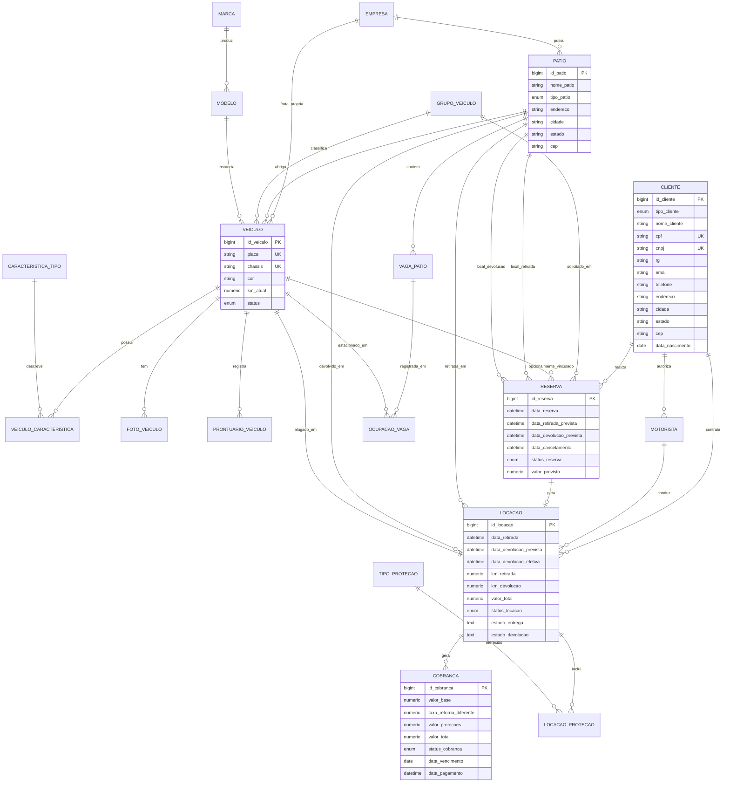
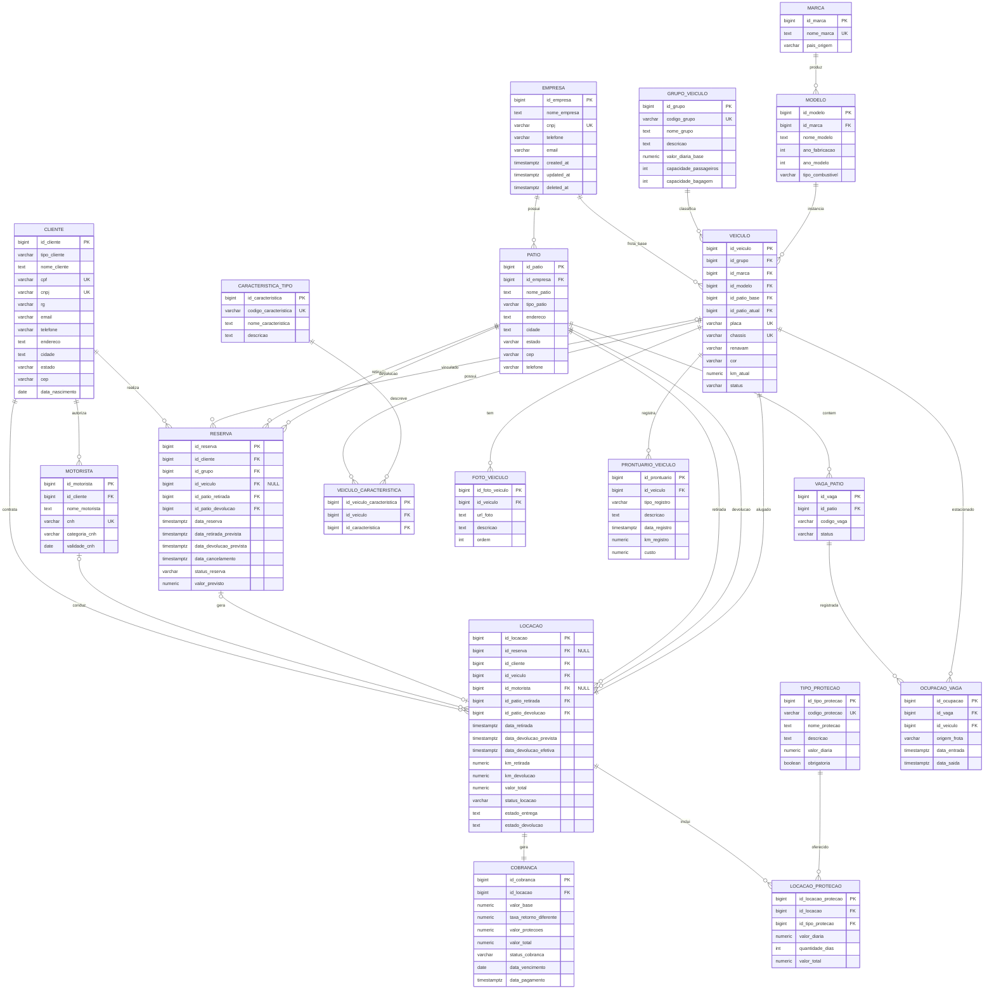
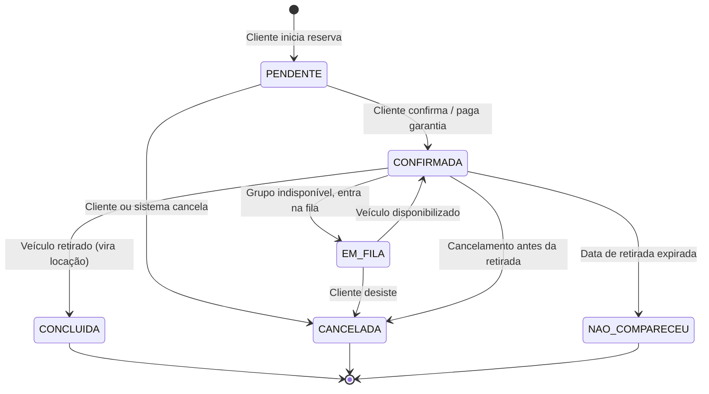
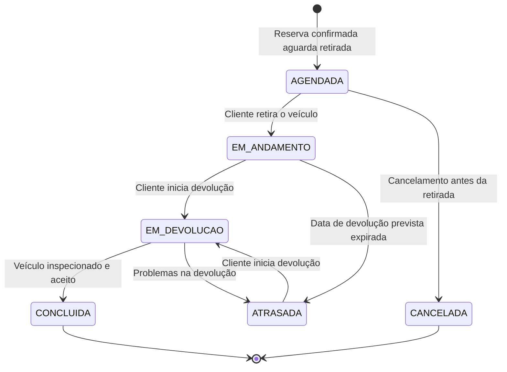
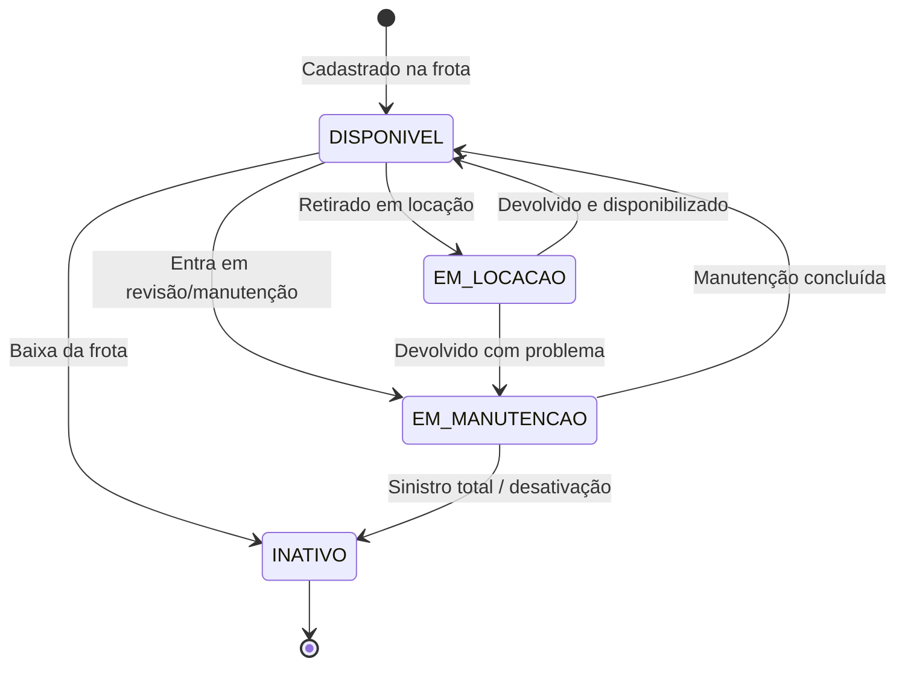

# Parte I — Projeto do Banco de Dados Relacional

## Identificação

**Disciplina:** Modelagem de Data Warehouse  
**Tarefa:** Avaliação 01 — Parte I (Modelagem SBD OLTP)  
**Grupo:** Hygor Goulart Knust - 117124785 
**Data:** Abril/2026

---

## Sumário

1. [Introdução](#1-introdução)
2. [Modelo Conceitual (MER)](#2-modelo-conceitual-mer)
3. [Modelo Lógico Relacional](#3-modelo-lógico-relacional)
4. [Diagramas de Estado](#4-diagramas-de-estado)
5. [Justificativas de Modelagem](#5-justificativas-de-modelagem)
6. [Dicionário de Dados](#6-dicionário-de-dados)
7. [Modelo Físico](#7-modelo-físico)
8. [Restrições de Integridade](#8-restrições-de-integridade)

---

## 1. Introdução

Este documento apresenta o projeto completo do banco de dados relacional (OLTP) para **uma das seis empresas** do grupo de locadoras de veículos que compartilham pátios no Rio de Janeiro. O sistema transacional suporta:

- Cadastro de clientes (PF/PJ) e motoristas autorizados
- Controle da frota de veículos (marca, modelo, grupo, características)
- Sistema de reservas com fila de espera
- Sistema de locação (retirada e devolução em qualquer pátio)
- Sistema de cobrança com proteções adicionais
- Controle de pátio e ocupação de vagas

O projeto é apresentado em três níveis: **conceitual** (MER), **lógico** (relacional) e **físico** (SQL/DDL ANSI), seguindo o padrão de projeto de banco de dados para sistemas transacionais.

---

## 2. Modelo Conceitual (MER)

O Modelo Entidade-Relacionamento foi construído considerando os cinco conceitos do universo de discurso: **cliente**, **veículos (frota)**, **pátio**, **reservas** e **locações**.

### Diagrama MER

### Entidades e Atributos

| Entidade | Descrição | Identificador |
|----------|-----------|---------------|
| **Empresa** | Uma das 6 locadoras do grupo | `id_empresa` (surrogate), `cnpj` (natural) |
| **Pátio** | Local físico de estacionamento e atendimento | `id_patio` (surrogate) |
| **Grupo Veículo** | Categoria de veículo (Econômico, SUV, etc.) | `id_grupo` (surrogate), `codigo_grupo` (natural) |
| **Marca** | Fabricante do veículo | `id_marca` (surrogate), `nome_marca` (natural) |
| **Modelo** | Modelo específico de uma marca | `id_modelo` (surrogate) |
| **Característica Tipo** | Acessórios e equipamentos disponíveis | `id_caracteristica` (surrogate) |
| **Veículo** | Unidade da frota | `id_veiculo` (surrogate), `placa` (natural), `chassis` (natural) |
| **Vaga Pátio** | Posição de estacionamento em um pátio | `id_vaga` (surrogate), `(id_patio, codigo_vaga)` (natural) |
| **Cliente** | Locatário (PF ou PJ) | `id_cliente` (surrogate), `cpf`/`cnpj` (natural) |
| **Motorista** | Condutor autorizado (vinculado a cliente) | `id_motorista` (surrogate), `cnh` (natural) |
| **Reserva** | Solicitação de locação futura | `id_reserva` (surrogate) |
| **Locação** | Contrato de aluguel efetivado | `id_locacao` (surrogate) |
| **Cobrança** | Documento financeiro da locação | `id_cobranca` (surrogate) |
| **Tipo Proteção** | Seguros e proteções adicionais | `id_tipo_protecao` (surrogate), `codigo_protecao` (natural) |
| **Locação Proteção** | Proteções contratadas em uma locação | `id_locacao_protecao` (surrogate) |
| **Ocupação Vaga** | Registro histórico de estacionamento | `id_ocupacao` (surrogate) |
| **Foto Veículo** | Imagens do veículo | `id_foto_veiculo` (surrogate) |
| **Prontuário Veículo** | Manutenções e ocorrências | `id_prontuario` (surrogate) |

---

## 3. Modelo Lógico Relacional

O modelo lógico traduz o MER para o paradigma relacional, definindo chaves, tipos de dados e cardinalidades.

### Diagrama Relacional

### Notação Utilizada

- **Chave Primária (PK):** `bigserial` — surrogate key auto-incrementável
- **Chave Única (UK):** chaves naturais (CNPJ, CPF, placa, chassis, CNH)
- **Chave Estrangeira (FK):** referências com `ON DELETE RESTRICT` (padrão)
- **Soft Delete:** campo `deleted_at` em todas as tabelas transacionais e dimensionais
- **Auditoria:** `created_at` e `updated_at` em todas as tabelas

---

## 4. Diagramas de Estado

### Ciclo de Vida da Reserva

**Transições:**
- `PENDENTE → CONFIRMADA`: quando o cliente efetiva a reserva
- `CONFIRMADA → EM_FILA`: quando não há veículos do grupo disponíveis na janela
- `CONFIRMADA → CONCLUIDA`: quando a locação é iniciada (trigger automático)
- `CONFIRMADA → NAO_COMPARECEU`: quando a data de retirada expira sem o cliente aparecer
- Qualquer estado terminal (exceto CONCLUIDA) pode ser motivo de cobrança de no-show

### Ciclo de Vida da Locação

**Transições:**
- `AGENDADA → EM_ANDAMENTO`: quando o veículo é retirado do pátio
- `EM_ANDAMENTO → ATRASADA`: quando `data_devolucao_prevista < now()`
- `EM_ANDAMENTO → EM_DEVOLUCAO`: quando o cliente chega ao pátio para devolver
- `EM_DEVOLUCAO → CONCLUIDA`: após vistoria e cálculo de cobrança final
- A cobrança final pode ajustar valores por: diárias extras, KM excedente, danos

### Ciclo de Vida do Veículo

---

## 5. Justificativas de Modelagem

### 5.1 Uso de Chaves Surrogate

Todas as tabelas possuem uma chave primária `bigserial` (surrogate) **além** das chaves naturais (CNPJ, placa, chassis, CPF, CNH). Esta decisão é fundamentada em:

1. **Imutabilidade:** chaves naturais podem mudar (ex: correção de CNPJ, troca de placa por Mercosul)
2. **Performance:** joins por `bigint` são mais eficientes que por `varchar`
3. **Preparação para DWH:** surrogate keys são essenciais para SCD (Slowly Changing Dimensions)
4. **Integração:** cada empresa do grupo tem seus próprios sistemas; surrogates evitam conflitos

### 5.2 Soft Delete (`deleted_at`)

Em vez de `DELETE` físico, todas as tabelas relevantes usam soft delete. Justificativas:

- **Auditoria fiscal:** necessidade de manter histórico de clientes e transações
- **Análise de churn:** clientes inativos são importantes para modelagem preditiva
- **Recuperação de dados:** reversão de exclusões acidentais
- **DWH:** o ETL precisa saber quando um registro foi removido do OLTP

Exceção: `foto_veiculo` e `prontuario_veiculo` não possuem `deleted_at` pois são registros de auditoria imutáveis.

### 5.3 Separação de Reserva e Locação

A reserva e a locação são modeladas como entidades separadas (não estados de uma mesma entidade) porque:

- **Ciclo de vida diferente:** uma reserva pode ser cancelada sem nunca virar locação
- **Métricas distintas:** taxa de conversão, no-show, lead time são métricas da reserva
- **Flexibilidade operacional:** permite walk-in (locação sem reserva prévia)
- **Cobrança separada:** a reserva pode ter garantia; a locação tem cobrança final

A relação é **1:0..1** (uma reserva gera no máximo uma locação; uma locação pode ter sido gerada por uma reserva ou não).

### 5.4 Cliente com Herança por Tipo (PF/PJ)

O modelo usa **uma única tabela** `cliente` com `tipo_cliente` discriminador, em vez de duas tabelas `cliente_pf` e `cliente_pj`. Justificativas:

- **Simplicidade:** a maioria das queries não precisa distinguir PF de PJ
- **Flexibilidade:** um cliente PJ também pode ter CPF (sócio, garantidor)
- **Constraint:** `chk_cliente_documento` garante que PF tenha CPF e PJ tenha CNPJ
- **Motorista:** a tabela `motorista` é vinculada a `cliente`, independentemente do tipo

### 5.5 Ocupação de Vaga vs. Status do Veículo

A `ocupacao_vaga` é modelada separadamente do `veiculo.status` porque:

- **Histórico:** precisamos saber onde o veículo esteve estacionado ao longo do tempo
- **Origem da frota:** campo `origem_frota` (FROTA_PROPRIA / FROTA_ASSOCIADA) é essencial para o relatório de controle de pátio
- **Múltiplas vagas:** um veículo pode ter ocupado várias vagas (manutenção, reposicionamento)
- **Pátio atual:** `veiculo.id_patio_atual` é o estado atual; `ocupacao_vaga` é o histórico

### 5.6 Proteções como Entidade Separada

As proteções contratadas (`locacao_protecao`) são uma entidade associativa entre `locacao` e `tipo_protecao`, não atributos da locação. Justificativas:

- **Variedade:** número e tipo de proteções variam por locação
- **Cálculo:** valor_total = Σ(valor_diaria × quantidade_dias) para cada proteção
- **Relatórios:** análise de quais proteções são mais contratadas
- **Extensibilidade:** novas proteções podem ser adicionadas sem alterar o schema

---

## 6. Dicionário de Dados

### 6.1 Tabelas de Domínio

#### `empresa`

| Coluna | Tipo | Restrição | Descrição |
|--------|------|-----------|-----------|
| `id_empresa` | `bigserial` | PK | Chave surrogate da empresa |
| `nome_empresa` | `text` | NOT NULL | Razão social |
| `cnpj` | `varchar(18)` | UK, NOT NULL | CNPJ com máscara (14 dígitos + formatação) |
| `telefone` | `varchar(20)` | NULL | Telefone comercial |
| `email` | `varchar(255)` | NULL | Email institucional |
| `created_at` | `timestamptz` | DEFAULT now() | Data de criação do registro |
| `updated_at` | `timestamptz` | DEFAULT now() | Data da última atualização |
| `deleted_at` | `timestamptz` | NULL | Soft delete (NULL = ativo) |

**Restrições:** `uk_empresa_cnpj` — CNPJ deve ser único entre empresas ativas.

#### `patio`

| Coluna | Tipo | Restrição | Descrição |
|--------|------|-----------|-----------|
| `id_patio` | `bigserial` | PK | Chave surrogate do pátio |
| `id_empresa` | `bigint` | FK → empresa, NOT NULL | Empresa dona do pátio |
| `nome_patio` | `text` | NOT NULL | Nome do local (ex: "Galeão") |
| `tipo_patio` | `varchar(20)` | CHECK (AEROPORTO\|RODOVIARIA\|SHOPPING) | Categoria do local |
| `endereco` | `text` | NOT NULL | Endereço completo |
| `cidade` | `text` | DEFAULT 'Rio de Janeiro' | Cidade |
| `estado` | `varchar(2)` | DEFAULT 'RJ' | UF |
| `cep` | `varchar(9)` | NULL | CEP formatado |
| `telefone` | `varchar(20)` | NULL | Telefone local |
| `created_at` | `timestamptz` | DEFAULT now() | |
| `updated_at` | `timestamptz` | DEFAULT now() | |
| `deleted_at` | `timestamptz` | NULL | |

**Restrições:** FK com `ON DELETE RESTRICT` — não permite excluir empresa com pátios vinculados.

#### `grupo_veiculo`

| Coluna | Tipo | Restrição | Descrição |
|--------|------|-----------|-----------|
| `id_grupo` | `bigserial` | PK | |
| `codigo_grupo` | `varchar(3)` | UK, NOT NULL | Sigla: ECN, INT, SUV, EXC, LUX, VAN, PIC |
| `nome_grupo` | `text` | NOT NULL | Nome legível (Econômico, SUV, etc.) |
| `descricao` | `text` | NULL | Modelos típicos do grupo |
| `valor_diaria_base` | `numeric(15,2)` | NOT NULL | Valor base da diária em R$ |
| `capacidade_passageiros` | `integer` | NULL | Lotação |
| `capacidade_bagagem` | `integer` | NULL | Porta-malas (em malas) |

#### `marca`

| Coluna | Tipo | Restrição | Descrição |
|--------|------|-----------|-----------|
| `id_marca` | `bigserial` | PK | |
| `nome_marca` | `text` | UK, NOT NULL | Fiat, Volkswagen, Toyota, etc. |
| `pais_origem` | `varchar(50)` | NULL | Brasil, Alemanha, Japão, etc. |

#### `modelo`

| Coluna | Tipo | Restrição | Descrição |
|--------|------|-----------|-----------|
| `id_modelo` | `bigserial` | PK | |
| `id_marca` | `bigint` | FK → marca, NOT NULL | |
| `nome_modelo` | `text` | NOT NULL | Argo, Corolla, Compass, etc. |
| `ano_fabricacao` | `integer` | NOT NULL | Ano de fabricação |
| `ano_modelo` | `integer` | NOT NULL | Ano do modelo |
| `tipo_combustivel` | `varchar(20)` | CHECK (FLEX\|GASOLINA\|ALCOOL\|DIESEL\|ELETRICO\|HIBRIDO) | |

#### `caracteristica_tipo`

| Coluna | Tipo | Restrição | Descrição |
|--------|------|-----------|-----------|
| `id_caracteristica` | `bigserial` | PK | |
| `codigo_caracteristica` | `varchar(30)` | UK, NOT NULL | ar_condicionado, direcao_eletrica, etc. |
| `nome_caracteristica` | `text` | NOT NULL | Nome legível |
| `descricao` | `text` | NULL | |

#### `tipo_protecao`

| Coluna | Tipo | Restrição | Descrição |
|--------|------|-----------|-----------|
| `id_tipo_protecao` | `bigserial` | PK | |
| `codigo_protecao` | `varchar(10)` | UK, NOT NULL | BASICA, LDW, PEC, ALI, etc. |
| `nome_protecao` | `text` | NOT NULL | |
| `descricao` | `text` | NULL | |
| `valor_diaria` | `numeric(15,2)` | DEFAULT 0 | Valor adicional por diária |
| `obrigatoria` | `boolean` | DEFAULT false | Se é cobrada automaticamente |

### 6.2 Tabelas de Veículos

#### `veiculo`

| Coluna | Tipo | Restrição | Descrição |
|--------|------|-----------|-----------|
| `id_veiculo` | `bigserial` | PK | |
| `id_grupo` | `bigint` | FK → grupo_veiculo, NOT NULL | Categoria |
| `id_marca` | `bigint` | FK → marca, NOT NULL | |
| `id_modelo` | `bigint` | FK → modelo, NOT NULL | |
| `id_patio_base` | `bigint` | FK → patio, NOT NULL | Pátio da empresa dona |
| `id_patio_atual` | `bigint` | FK → patio, NULL | Pátio onde está fisicamente |
| `placa` | `varchar(8)` | UK, NOT NULL | Placa Mercosul ou antiga |
| `chassis` | `varchar(17)` | UK, NOT NULL | VIN (17 caracteres) |
| `renavam` | `varchar(11)` | NULL | RENAVAM do veículo |
| `cor` | `varchar(30)` | NOT NULL | |
| `km_atual` | `numeric(12,3)` | DEFAULT 0 | Quilometragem atual |
| `status` | `varchar(20)` | CHECK (DISPONIVEL\|EM_MANUTENCAO\|EM_LOCACAO\|INATIVO) | |

**Restrições:** `uk_veiculo_placa`, `uk_veiculo_chassis`

#### `veiculo_caracteristica`

| Coluna | Tipo | Restrição | Descrição |
|--------|------|-----------|-----------|
| `id_veiculo_caracteristica` | `bigserial` | PK | |
| `id_veiculo` | `bigint` | FK → veiculo, NOT NULL | |
| `id_caracteristica` | `bigint` | FK → caracteristica_tipo, NOT NULL | |

**Restrições:** `uk_veiculo_caracteristica` — par (veiculo, caracteristica) deve ser único

#### `foto_veiculo`

| Coluna | Tipo | Restrição | Descrição |
|--------|------|-----------|-----------|
| `id_foto_veiculo` | `bigserial` | PK | |
| `id_veiculo` | `bigint` | FK → veiculo, NOT NULL | |
| `url_foto` | `text` | NOT NULL | URL da imagem |
| `descricao` | `text` | NULL | Legenda da foto |
| `ordem` | `integer` | DEFAULT 0 | Ordem de exibição |

#### `prontuario_veiculo`

| Coluna | Tipo | Restrição | Descrição |
|--------|------|-----------|-----------|
| `id_prontuario` | `bigserial` | PK | |
| `id_veiculo` | `bigint` | FK → veiculo, NOT NULL | |
| `tipo_registro` | `varchar(30)` | CHECK (REVISAO\|MANUTENCAO\|SINISTRO\|TROCA_PECA\|LIMPEZA\|VISTORIA) | |
| `descricao` | `text` | NOT NULL | Detalhamento do registro |
| `data_registro` | `timestamptz` | NOT NULL | Quando ocorreu |
| `km_registro` | `numeric(12,3)` | NULL | KM no momento do registro |
| `custo` | `numeric(15,2)` | NULL | Custo em R$ |

#### `vaga_patio`

| Coluna | Tipo | Restrição | Descrição |
|--------|------|-----------|-----------|
| `id_vaga` | `bigserial` | PK | |
| `id_patio` | `bigint` | FK → patio, NOT NULL | |
| `codigo_vaga` | `varchar(10)` | NOT NULL | Ex: A01, B12, G34 |
| `status` | `varchar(20)` | CHECK (LIVRE\|OCUPADA\|RESERVADA\|MANUTENCAO) | |

**Restrições:** `uk_vaga_patio_codigo` — par (patio, codigo_vaga) deve ser único

### 6.3 Tabelas de Cliente e Motorista

#### `cliente`

| Coluna | Tipo | Restrição | Descrição |
|--------|------|-----------|-----------|
| `id_cliente` | `bigserial` | PK | |
| `tipo_cliente` | `varchar(2)` | CHECK (PF\|PJ), NOT NULL | |
| `nome_cliente` | `text` | NOT NULL | Nome completo (PF) ou razão social (PJ) |
| `cpf` | `varchar(14)` | UK, NULL | CPF formatado (somente PF) |
| `cnpj` | `varchar(18)` | UK, NULL | CNPJ formatado (somente PJ) |
| `rg` | `varchar(20)` | NULL | RG (somente PF) |
| `email` | `varchar(255)` | NULL | |
| `telefone` | `varchar(20)` | NULL | |
| `endereco` | `text` | NULL | |
| `cidade` | `text` | NULL | |
| `estado` | `varchar(2)` | NULL | |
| `cep` | `varchar(9)` | NULL | |
| `data_nascimento` | `date` | NULL | (somente PF) |

**Restrições:**
- `uk_cliente_cpf` — CPF único (entre clientes ativos)
- `uk_cliente_cnpj` — CNPJ único
- `chk_cliente_documento` — PF deve ter CPF; PJ deve ter CNPJ

#### `motorista`

| Coluna | Tipo | Restrição | Descrição |
|--------|------|-----------|-----------|
| `id_motorista` | `bigserial` | PK | |
| `id_cliente` | `bigint` | FK → cliente, NOT NULL | Cliente dono do veículo |
| `nome_motorista` | `text` | NOT NULL | Nome do condutor |
| `cnh` | `varchar(11)` | UK, NOT NULL | Número da CNH |
| `categoria_cnh` | `varchar(2)` | CHECK (B\|C\|D\|E\|AB\|AC\|AD\|AE), NOT NULL | |
| `validade_cnh` | `date` | NOT NULL | Data de expiração |

### 6.4 Tabelas Transacionais

#### `reserva`

| Coluna | Tipo | Restrição | Descrição |
|--------|------|-----------|-----------|
| `id_reserva` | `bigserial` | PK | |
| `id_cliente` | `bigint` | FK → cliente, NOT NULL | |
| `id_grupo` | `bigint` | FK → grupo_veiculo, NOT NULL | Grupo desejado |
| `id_veiculo` | `bigint` | FK → veiculo, NULL | Veículo específico (opcional) |
| `id_patio_retirada` | `bigint` | FK → patio, NOT NULL | |
| `id_patio_devolucao` | `bigint` | FK → patio, NOT NULL | |
| `data_reserva` | `timestamptz` | NOT NULL | Quando foi feita |
| `data_retirada_prevista` | `timestamptz` | NOT NULL | |
| `data_devolucao_prevista` | `timestamptz` | NOT NULL | |
| `data_cancelamento` | `timestamptz` | NULL | Quando cancelou |
| `status_reserva` | `varchar(20)` | CHECK (PENDENTE\|CONFIRMADA\|EM_FILA\|CANCELADA\|NAO_COMPARECEU\|CONCLUIDA) | |
| `valor_previsto` | `numeric(15,2)` | NULL | Estimativa de valor |

**Restrições:** `chk_reserva_datas` — `data_devolucao_prevista > data_retirada_prevista`

#### `locacao`

| Coluna | Tipo | Restrição | Descrição |
|--------|------|-----------|-----------|
| `id_locacao` | `bigserial` | PK | |
| `id_reserva` | `bigint` | FK → reserva, NULL | Pode ser walk-in |
| `id_cliente` | `bigint` | FK → cliente, NOT NULL | |
| `id_veiculo` | `bigint` | FK → veiculo, NOT NULL | |
| `id_motorista` | `bigint` | FK → motorista, NULL | Condutor (opcional) |
| `id_patio_retirada` | `bigint` | FK → patio, NOT NULL | |
| `id_patio_devolucao` | `bigint` | FK → patio, NOT NULL | |
| `data_retirada` | `timestamptz` | NOT NULL | |
| `data_devolucao_prevista` | `timestamptz` | NOT NULL | |
| `data_devolucao_efetiva` | `timestamptz` | NULL | |
| `km_retirada` | `numeric(12,3)` | NOT NULL | KM no momento da retirada |
| `km_devolucao` | `numeric(12,3)` | NULL | KM no momento da devolução |
| `valor_total` | `numeric(15,2)` | NULL | Valor final |
| `status_locacao` | `varchar(20)` | CHECK (AGENDADA\|EM_ANDAMENTO\|ATRASADA\|EM_DEVOLUCAO\|CONCLUIDA\|CANCELADA) | |
| `estado_entrega` | `text` | NULL | Observações da vistoria de retirada |
| `estado_devolucao` | `text` | NULL | Observações da vistoria de devolução |

**Restrições:**
- `chk_locacao_datas` — `data_devolucao_prevista >= data_retirada`
- `chk_locacao_km` — `km_devolucao >= km_retirada` (se não nulo)

#### `cobranca`

| Coluna | Tipo | Restrição | Descrição |
|--------|------|-----------|-----------|
| `id_cobranca` | `bigserial` | PK | |
| `id_locacao` | `bigint` | FK → locacao, NOT NULL | |
| `valor_base` | `numeric(15,2)` | NOT NULL | Diárias × valor_diaria |
| `taxa_retorno_diferente` | `numeric(15,2)` | DEFAULT 0 | Taxa se patio_retirada ≠ patio_devolucao |
| `valor_protecoes` | `numeric(15,2)` | DEFAULT 0 | Soma das proteções adicionais |
| `valor_total` | `numeric(15,2)` | NOT NULL | Valor final |
| `status_cobranca` | `varchar(20)` | CHECK (PENDENTE\|PAGO\|ATRASADO\|CANCELADO\|REEMBOLSADO) | |
| `data_vencimento` | `date` | NOT NULL | |
| `data_pagamento` | `timestamptz` | NULL | |

#### `locacao_protecao`

| Coluna | Tipo | Restrição | Descrição |
|--------|------|-----------|-----------|
| `id_locacao_protecao` | `bigserial` | PK | |
| `id_locacao` | `bigint` | FK → locacao, NOT NULL | |
| `id_tipo_protecao` | `bigint` | FK → tipo_protecao, NOT NULL | |
| `valor_diaria` | `numeric(15,2)` | NOT NULL | Valor unitário por diária |
| `quantidade_dias` | `integer` | NOT NULL | Número de diárias cobertas |
| `valor_total` | `numeric(15,2)` | NOT NULL | valor_diaria × quantidade_dias |

#### `ocupacao_vaga`

| Coluna | Tipo | Restrição | Descrição |
|--------|------|-----------|-----------|
| `id_ocupacao` | `bigserial` | PK | |
| `id_vaga` | `bigint` | FK → vaga_patio, NOT NULL | |
| `id_veiculo` | `bigint` | FK → veiculo, NOT NULL | |
| `origem_frota` | `varchar(20)` | CHECK (FROTA_PROPRIA\|FROTA_ASSOCIADA) | |
| `data_entrada` | `timestamptz` | NOT NULL | |
| `data_saida` | `timestamptz` | NULL | NULL = ainda ocupada |

**Restrições:** `chk_ocupacao_datas` — `data_saida >= data_entrada`

---

## 7. Modelo Físico

O modelo físico está implementado no arquivo:

📄 **`migrations/001_create_schema.sql`**

Características:
- **SGBD:** PostgreSQL 16
- **Padrão:** ANSI SQL a partir do SQL99 (SQL3)
- **Recursos utilizados:**
  - `CHECK` constraints para domínios enumerados
  - `UNIQUE` constraints para chaves naturais
  - `FOREIGN KEY` com `ON DELETE RESTRICT` (padrão)
  - `TIMESTAMP WITH TIME ZONE` para todas as datas/horas
  - `NUMERIC(p,s)` para valores monetários
  - Índices de apoio para performance de queries frequentes

### Índices Criados

| Índice | Tabela | Coluna(s) | Propósito |
|--------|--------|-----------|-----------|
| `idx_veiculo_status` | veiculo | `status` | Filtrar veículos disponíveis |
| `idx_veiculo_patio_atual` | veiculo | `id_patio_atual` | Listar frota por pátio |
| `idx_cliente_tipo` | cliente | `tipo_cliente` | Separar PF/PJ em relatórios |
| `idx_reserva_cliente` | reserva | `id_cliente` | Histórico de reservas por cliente |
| `idx_reserva_status` | reserva | `status_reserva` | Dashboard de pipeline |
| `idx_locacao_veiculo` | locacao | `id_veiculo` | Histórico de locações por veículo |
| `idx_locacao_status` | locacao | `status_locacao` | Veículos em uso/atrasados |
| `idx_cobranca_locacao` | cobranca | `id_locacao` | Busca rápida de cobrança |
| `idx_ocupacao_vaga` | ocupacao_vaga | `id_vaga` | Verificar ocupação atual |
| `idx_ocupacao_veiculo` | ocupacao_vaga | `id_veiculo` | Histórico de estacionamento |

---

## 8. Restrições de Integridade

### 8.1 Integridade de Entidade

Todas as tabelas possuem chave primária única e não nula. Chaves naturais (CNPJ, placa, chassis, CPF, CNH) possuem constraint `UNIQUE` para garantir que não haja duplicidade no domínio de negócio.

### 8.2 Integridade Referencial

Todas as chaves estrangeiras usam `ON DELETE RESTRICT`, ou seja, não é possível excluir um registro pai se existirem filhos vinculados. Exemplos:

- Não é possível excluir uma `empresa` que possua `patio`s
- Não é possível excluir um `cliente` que tenha `reserva`s ou `locacao`s
- Não é possível excluir um `veiculo` que tenha `locacao`s

### 8.3 Integridade de Domínio

| Tabela | Constraint | Regra |
|--------|-----------|-------|
| `patio` | `chk_patio_tipo` | `tipo_patio IN ('AEROPORTO', 'RODOVIARIA', 'SHOPPING')` |
| `modelo` | `chk_modelo_combustivel` | `tipo_combustivel IN ('FLEX', 'GASOLINA', 'ALCOOL', 'DIESEL', 'ELETRICO', 'HIBRIDO')` |
| `veiculo` | `chk_veiculo_status` | `status IN ('DISPONIVEL', 'EM_MANUTENCAO', 'EM_LOCACAO', 'INATIVO')` |
| `vaga_patio` | `chk_vaga_status` | `status IN ('LIVRE', 'OCUPADA', 'RESERVADA', 'MANUTENCAO')` |
| `cliente` | `chk_cliente_documento` | PF → CPF não nulo; PJ → CNPJ não nulo |
| `motorista` | `chk_motorista_categoria` | `categoria_cnh IN ('B', 'C', 'D', 'E', 'AB', 'AC', 'AD', 'AE')` |
| `reserva` | `chk_reserva_datas` | `data_devolucao_prevista > data_retirada_prevista` |
| `reserva` | `chk_reserva_status` | 6 status válidos |
| `locacao` | `chk_locacao_datas` | `data_devolucao_prevista >= data_retirada` |
| `locacao` | `chk_locacao_km` | `km_devolucao >= km_retirada` (se não nulo) |
| `locacao` | `chk_locacao_status` | 6 status válidos |
| `cobranca` | `chk_cobranca_status` | 5 status válidos |
| `ocupacao_vaga` | `chk_ocupacao_datas` | `data_saida >= data_entrada` |
| `ocupacao_vaga` | `chk_ocupacao_origem` | `origem_frota IN ('FROTA_PROPRIA', 'FROTA_ASSOCIADA')` |

### 8.4 Integridade Semântica

Além das constraints de banco, a aplicação deve garantir:

1. **Sobreposição de locações:** um veículo não pode ter duas locações com períodos sobrepostos
2. **Cliente PJ com motorista:** todo cliente PJ deve ter pelo menos um motorista cadastrado
3. **Reserva cancelada:** não gera locação
4. **Veículo em locação:** `status` deve ser `EM_LOCACAO` e `id_patio_atual` deve refletir o pátio de retirada
5. **Cobrança:** `valor_total = valor_base + taxa_retorno_diferente + valor_protecoes`

---

## Referências

- Elmasri, R. & Navathe, S. B. *Sistemas de Banco de Dados*. 7ª ed. Pearson, 2019.
- Kimball, R. & Ross, M. *The Data Warehouse Toolkit*. 3ª ed. Wiley, 2013.
- PostgreSQL Documentation. *CREATE TABLE*. https://www.postgresql.org/docs/16/sql-createtable.html
