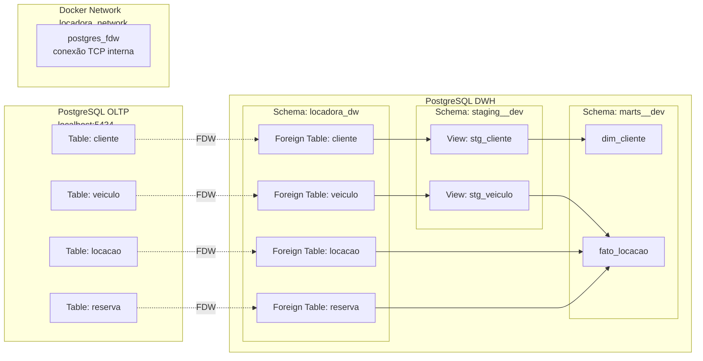
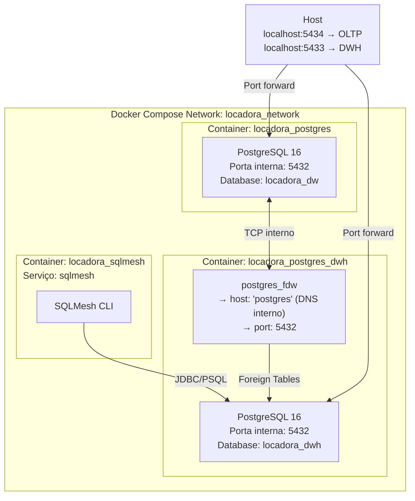

# Integração OLTP → DWH via PostgreSQL Foreign Data Wrapper (FDW)

## Problema

O projeto tem **dois bancos PostgreSQL separados**:

| Banco | Porta | Propósito |
|-------|-------|-----------|
| **OLTP** | 5434 | Sistema transacional (reservas, locações, cadastros) |
| **DWH** | 5433 | Data Warehouse analítico (dimensões, fatos, relatórios) |

O SQLMesh precisa ler os dados do OLTP para transformá-los no DWH. Como fazer isso sem replicar dados fisicamente?

## Solução: postgres_fdw

O **Foreign Data Wrapper (FDW)** é uma extensão nativa do PostgreSQL que permite que um banco acesse tabelas de outro banco como se fossem tabelas locais.



---

## Configuração no DWH

A configuração é feita automaticamente na inicialização do container DWH via script `postgres-dwh/init/02_setup_fdw.sql`:

### Passo 1: Habilitar a extensão

```sql
CREATE EXTENSION IF NOT EXISTS postgres_fdw;
```

### Passo 2: Criar o servidor FDW

```sql
CREATE SERVER IF NOT EXISTS oltp_server
    FOREIGN DATA WRAPPER postgres_fdw
    OPTIONS (
        host 'postgres',      -- nome do serviço Docker
        port '5432',          -- porta interna do container
        dbname 'locadora_dw'  -- database do OLTP
    );
```

### Passo 3: Mapear usuário

```sql
CREATE USER MAPPING IF NOT EXISTS FOR locadora_admin
    SERVER oltp_server
    OPTIONS (
        user 'locadora_admin',
        password 'locadora_secret_2024'
    );
```

### Passo 4: Importar as tabelas

```sql
CREATE SCHEMA IF NOT EXISTS locadora_dw;

IMPORT FOREIGN SCHEMA public
    FROM SERVER oltp_server
    INTO locadora_dw;
```

Isso cria **foreign tables** no schema `locadora_dw` do DWH que espelham as tabelas do OLTP.

---

## Diferença entre Foreign Table e Tabela Local

| Característica | Foreign Table (FDW) | Tabela Local |
|---------------|---------------------|--------------|
| **Armazenamento** | Não armazena dados | Armazena dados fisicamente |
| **Performance** | Depende da rede/latência | Acesso direto ao disco |
| **Atualização** | Sempre reflete o OLTP | Requer ETL explícito |
| **Consultas** | SELECT, INSERT, UPDATE, DELETE possíveis | Controle total |
| **Índices** | Usa índices do banco remoto | Próprios índices locais |

No nosso projeto, usamos FDW **apenas para SELECT** nos modelos staging. Os dados transformados são materializados fisicamente nas tabelas do DWH.

---

## Exemplo Prático: Staging View

```sql
-- staging.stg_cliente lê diretamente do OLTP via FDW
MODEL (
    name staging.stg_cliente,
    kind view
);

SELECT
    c.id_cliente as id_cliente_source,
    trim(c.nome_cliente) as nome_cliente,
    trim(c.cpf) as cpf,
    trim(lower(c.email)) as email,
    c.tipo_cliente,
    c.cidade,
    c.created_at as created_at_source,
    c.deleted_at,
    (c.deleted_at is not null) as is_deleted
FROM locadora_dw.cliente as c;  -- <-- foreign table!
```

A query acima é executada no DWH, mas a tabela `locadora_dw.cliente` é um proxy que delega a leitura ao banco OLTP via conexão TCP interna do Docker.

---

## Arquitetura de Rede Docker



### DNS Interno do Docker Compose

O nome do serviço `postgres` no `docker-compose.yml` se torna um hostname resolvível dentro da rede Docker. O DWH se conecta ao OLTP usando `host 'postgres'`, não um IP fixo:

```yaml
# docker-compose.yml
services:
  postgres:
    container_name: locadora_postgres
    # ...

  postgres-dwh:
    container_name: locadora_postgres_dwh
    # O FDW se conecta em 'postgres:5432'
```

---

## Vantagens desta Arquitetura

1. **Sem replicação física:** os dados do OLTP não são copiados para o DWH; são lidos sob demanda
2. **Always fresh:** os modelos staging sempre veem os dados mais recentes do OLTP
3. **Isolamento:** o OLTP não é impactado por queries analíticas pesadas (elas rodam no DWH)
4. **Simplicidade:** não precisa de Kafka, Debezium ou Airflow para sincronização inicial
5. **Transparência:** para o SQLMesh, é como se os dados estivessem no mesmo banco

## Limitações

1. **Performance:** queries complexas em foreign tables podem ser lentas se o PostgreSQL precisar buscar muitos dados pela rede
2. **Indisponibilidade:** se o OLTP cair, o FDW falha (não há cache local)
3. **Escrita:** INSERT/UPDATE em foreign tables é possível mas não recomendado (usamos apenas SELECT)
4. **Volume:** para TBs de dados, ETL batch com extração física é mais eficiente

## Comandos de Verificação

```bash
# Verificar se FDW está ativo no DWH
docker-compose exec postgres-dwh psql -U locadora_admin -d locadora_dwh -c "
  SELECT foreign_server_name, foreign_table_name 
  FROM information_schema.foreign_tables;
"

# Verificar conexão FDW
docker-compose exec postgres-dwh psql -U locadora_admin -d locadora_dwh -c "
  SELECT * FROM locadora_dw.cliente LIMIT 5;
"

# Contar registros via FDW
docker-compose exec postgres-dwh psql -U locadora_admin -d locadora_dwh -c "
  SELECT COUNT(*) FROM locadora_dw.reserva;
"
```

---

## Alternativas Consideradas

| Alternativa | Por que não usamos |
|-----------|-------------------|
| **pg_dump + psql** (ETL batch) | Requeria orquestração externa (Airflow/Cron) |
| **Logical Replication** | Overkill para volume atual; requer configuração complexa de slots |
| **Kafka + Debezium** | Arquitetura event-driven seria excessiva para o escopo acadêmico |
| **dbt (ao invés de SQLMesh)** | SQLMesh oferece virtual environments e semantic diffs nativos |

O FDW foi escolhido como a solução **mais simples e adequada** ao volume e escopo do projeto, mantendo a porta aberta para evoluir para replicação física quando necessário.
