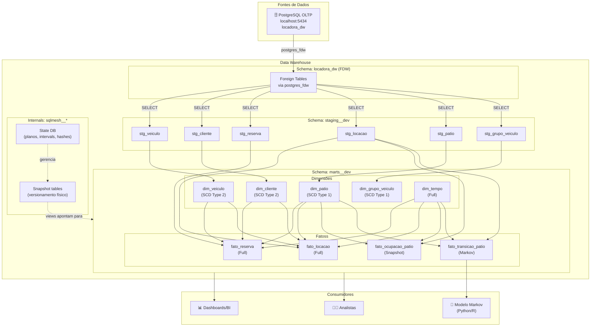
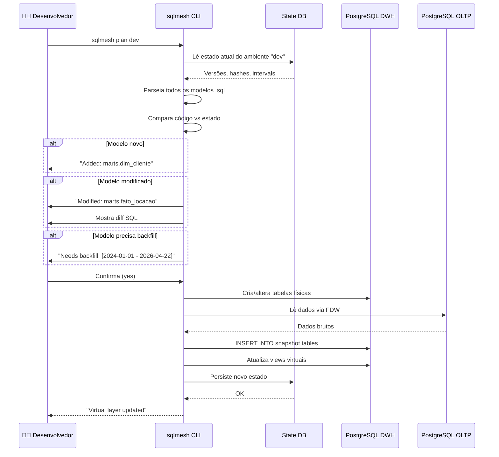
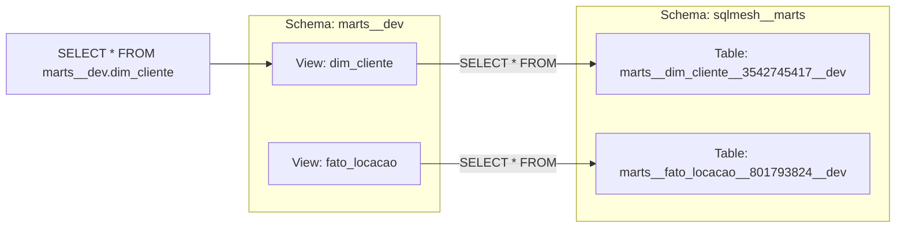

# SQLMesh no Projeto Locadora DW

## O que é SQLMesh?

SQLMesh é uma ferramenta de orquestração de transformações SQL (Transformation Layer) que substitui o dbt com abordagens mais modernas:

- **Semantic diffs**: compara o estado desejado (código) com o estado atual (banco) automaticamente
- **Virtual data environments**: cada ambiente (dev, staging, prod) é uma view layer sobre as mesmas tabelas físicas
- **Incremental models**: processa apenas o que mudou, não recria tudo
- **Built-in testing**: audits e assertions integrados ao pipeline
- **No Jinja templates**: usa SQL puro com macros reais (não string substitution)

---

## Arquitetura no Projeto



---

## Ciclo de Vida: Plan → Apply



---

## Estrutura do Projeto SQLMesh

```
sqlmesh_project/
├── config.yaml              # Conexões, gateways, model_defaults
├── audits/                  # Data quality checks
│   ├── audit_cliente_cpf_unico.sql
│   ├── audit_locacao_valor_positivo.sql
│   ├── audit_reserva_data_futura.sql
│   └── audit_veiculo_placa_unica.sql
├── macros/                  # Funções reutilizáveis em SQL
│   ├── data_util.sql        # trimestre_br, semestre_br, ano_mes
│   └── gerar_sk.sql         # Geração de surrogate key (MD5)
├── models/
│   ├── staging/             # Views sobre FDW
│   │   ├── stg_cliente.sql
│   │   ├── stg_grupo_veiculo.sql
│   │   ├── stg_locacao.sql
│   │   ├── stg_patio.sql
│   │   ├── stg_reserva.sql
│   │   └── stg_veiculo.sql
│   └── marts/
│       ├── dimensions/      # Dimensões SCD1/SCD2
│       │   ├── dim_cliente.sql
│       │   ├── dim_grupo_veiculo.sql
│       │   ├── dim_patio.sql
│       │   ├── dim_tempo.sql
│       │   └── dim_veiculo.sql
│       └── facts/           # Tabelas fato
│           ├── fato_locacao.sql
│           ├── fato_ocupacao_patio.sql
│           ├── fato_reserva.sql
│           └── fato_transicao_patio.sql
└── seeds/                   # Dados estáticos
    ├── dim_tempo.csv        # Calendário 2020-2030
    └── dim_tempo.sql        # Definição do seed
```

---

## Tipos de Materialização

| Tipo | Uso no Projeto | Descrição |
|------|---------------|-----------|
| `VIEW` | Staging (stg_*) | Não armazena dados; executa SELECT a cada consulta |
| `FULL` | Dimensões SCD1, Fatos | Recria a tabela inteira a cada execução |
| `SCD_TYPE_2_BY_TIME` | dim_cliente, dim_veiculo | Rastreia mudanças históricas com `valid_from`/`valid_to` |
| `INCREMENTAL_BY_TIME_RANGE` | (não usado no volume atual) | Processa apenas novos registros por intervalo de data |

### Por que usamos FULL para fatos?

Com volume médio (~1.500 reservas, ~852 locações), o custo de recriar tabelas é insignificante. O benefício:
- **Simplicidade:** não precisa gerenciar particionamento ou deduplicação
- **Consistência:** cada execução produz o mesmo resultado determinístico
- **Debug:** fácil inspecionar o snapshot table diretamente

Para produção com milhões de registros, migraríamos para `INCREMENTAL_BY_TIME_RANGE`.

---

## Virtual Layer: Como funciona?



O SQLMesh mantém **múltiplas versões físicas** das tabelas (snapshot tables com hash no nome) e expõe uma **view virtual** que sempre aponta para a versão correta. Isso permite:

- **Rollback instantâneo:** trocar a view para apontar para a versão anterior
- **Testes A/B:** comparar resultados entre versões
- **Zero-downtime deploys:** a view muda atomamente

---

## Comandos do Dia a Dia

```bash
# Verificar estado do projeto
make sqlmesh-info

# Planejar mudanças (preview, não aplica)
make sqlmesh-plan
# ou interativo:
docker-compose --profile sqlmesh run --rm sqlmesh sqlmesh plan dev

# Aplicar mudanças
make sqlmesh-apply

# Forçar recriação de um modelo específico
docker-compose --profile sqlmesh run --rm sqlmesh sqlmesh plan dev \
  --restate-model marts.dim_cliente \
  --auto-apply

# Ver diffs entre código e banco
docker-compose --profile sqlmesh run --rm sqlmesh sqlmesh diff dev
```

---

## Auditoria (Audits)

Cada modelo pode ter assertions de qualidade:

```sql
-- audit_cliente_cpf_unico.sql
audit (
  name assert_cliente_cpf_unico,
  dialect postgres
);

select *
from marts.dim_cliente
where sk_cliente in (
  select sk_cliente
  from marts.dim_cliente
  group by sk_cliente
  having count(*) > 1
);
```

Se o audit retornar qualquer linha, o `plan` falha automaticamente, garantindo integridade antes da publicação.
